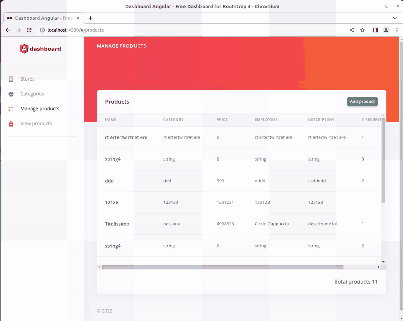
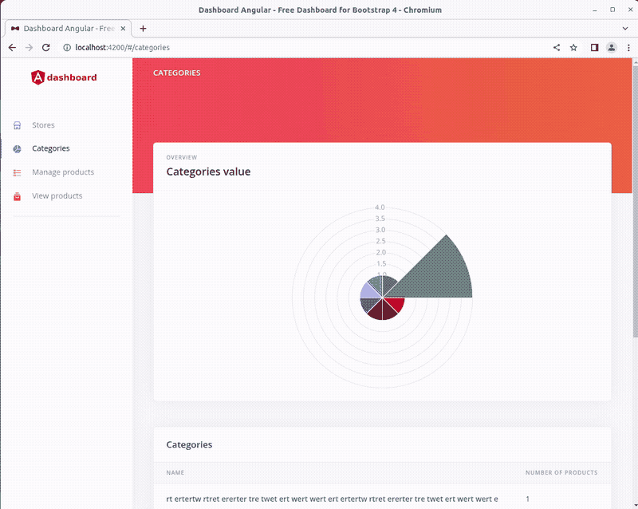
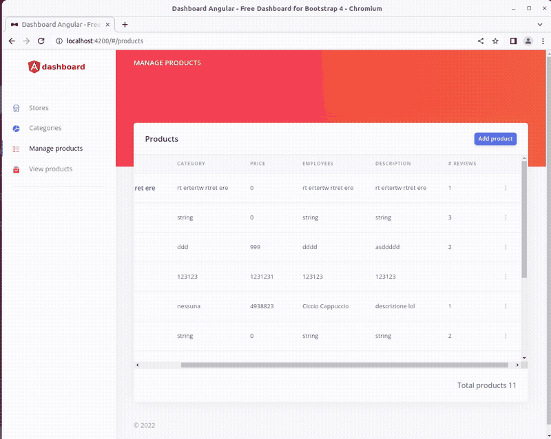

# dashboard-angular-products
 

    

        <h2>Categories</h2>
        
    

    

        <h2>Product-View</h2>
        
    

    

        <h2>Products</h2>
        
    

### Production
You can find the production Heroku link here: https://dashboard-angular-products.herokuapp.com/